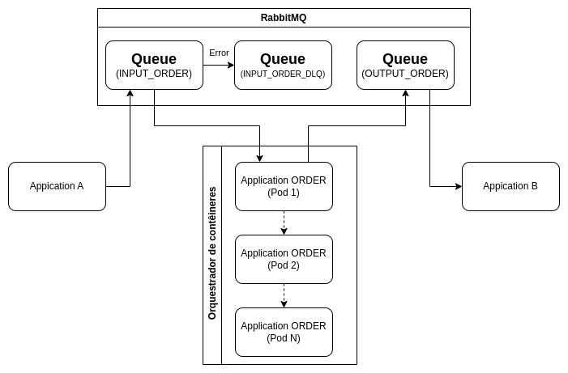

# Aplicação Order Management

## Visão Geral

O Order Management é um microserviço projetado para gerenciar pedidos de compra e venda de forma eficaz.
Funcionalidades

 - **Recebimento de Produtos:** A aplicação tem a capacidade de receber uma lista de produtos.

 - **Cálculo de Valores:** Gera o somatório total dos valores dos produtos da lista recebida.

 - **Repase das infomações:** Envia para outro/outros produtos a lista com o simatório dos dos valores dos podutos

# Conceitos importantes implementados na aplicação

## Arquitetura de microsserviços

A arquitetura de microsserviços é um estilo de desenvolvimento de software em que uma aplicação é estruturada como um
conjunto de serviços independentes e pequenos, chamados microsserviços. Cada microsserviço é responsável por uma 
funcionalidade específica e pode ser desenvolvido, implantado e escalado de forma independente.

### Características Principais

- **Independência:** Cada microsserviço opera de forma autônoma e não depende de outros para funcionar.

- **Desenvolvimento e Implantação Independentes:** Equipes podem trabalhar em diferentes microsserviços 
simultaneamente, facilitando a implementação contínua e a correção de falhas.

- **Escalabilidade:** Permite escalar apenas os serviços que necessitam de mais recursos, otimizando o uso de 
infraestrutura.

- **Tecnologia Variada:** Diferentes microsserviços podem ser desenvolvidos com diferentes tecnologias e linguagens de 
programação, dependendo das necessidades específicas.

### Vantagens

- **Flexibilidade:** Facilita a implementação de novas tecnologias e modificações sem impactar a aplicação inteira.

- **Resiliência:** Falhas em um microsserviço específico não impactam toda a aplicação, melhorando a disponibilidade.

- **Facilidade de Manutenção:** Atualizações e correções podem ser feitas isoladamente, reduzindo o tempo de inatividade.

### Desafios

- **Complexidade de Gerenciamento:** Requer uma boa estratégia de gerenciamento e orquestração para coordenar os diversos 
serviços.

- **Comunicação Inter-Serviços:** A comunicação entre microsserviços pode ser complexa e é fundamental definir protocolos 
e padrões eficazes.

- **Monitoramento e Debugging:** Exige ferramentas robustas para monitorar e depurar, dada a natureza distribuída dos 
serviços.

A arquitetura de microsserviços é ideal para aplicações grandes e complexas, onde a escalabilidade e a agilidade no 
desenvolvimento são cruciais.

## Arquitetura Hexagonal

A arquitetura hexagonal, também conhecida como arquitetura de ports and adapters, é um estilo de design de software 
que promove a separação clara entre o núcleo da aplicação e suas interações externas. Ela visa tornar sistemas mais 
flexíveis, testáveis e adaptáveis a mudanças.

### Estrutura

- **Núcleo da Aplicação:** Contém a lógica de negócios central e as regras de domínio, isolando-as das dependências 
externas.

- **Ports (Portas):** Interfaces que o núcleo usa para interagir com o mundo externo. Elas definem como o exterior 
pode se comunicar com o núcleo.

- **Adapters (Adaptadores):** Implementações concretas das interfaces definidas pelas portas. Eles lidam com os detalhes 
específicos de como interagir com serviços externos, bancos de dados, interfaces de usuário, etc.

### Vantagens

- **Independência de Tecnologia:** Facilita a troca de componentes externos sem impactar a lógica de negócios.

- **Testabilidade:** Permite testar o núcleo da aplicação isoladamente, utilizando mocks ou stubs para as interações 
externas.

- **Flexibilidade e Manutenção:** Modificações em componentes externos não afetam o núcleo, simplificando a manutenção.

### Aplicação Prática

Essa arquitetura é útil para projetos que requerem flexibilidade ao mudar ou evoluir tecnologias, e para garantir que o 
núcleo do negócio permaneça robusto e bem-isolado das interfaces externas. A arquitetura hexagonal ajuda a criar 
sistemas onde mudanças são menos impactantes e a manutenção se torna mais eficiente ao longo do tempo.

### Como isso é aplicado no Order Management

    /order-management
    │
    ├── /src                                # Diretório principal
    │   ├── main/java/com/order/management  # Diretório de classes Java
    │   │   ├── /application                # Camada da aplicação intermediária entre o domínio e infra
    │   │   │   ├── /handler                # Classes de handler
    │   │   │   ├── /mapper                 # Classes conversoras de objetos
    │   │   │   ├── /service                # Classes de Orquestração e implementações variadas
    │   │   │   │   ├── /orchestration      # Classes de orquestração d de portas e adaptadores 
    │   │   │   │   ├── /validate           # Classes de validação
    │   │   │   ├── /utils                  # Classes utils (Talvez deve-se ficar em service?)
    │   │   ├── /domain                     # Camada da aplicação onde estão as regras de negócio
    │   │   │   ├── /exception              # Classes de Exceção
    │   │   │   ├── /model                  # Classes de modelo (Objetos)
    │   │   │   ├── /port                   # Classes das Portas (interfaces)
    │   │   ├── /infrasctruture             # Camada da aplicação que implementa os adaptadores externos
    │   │   │   ├── /adapter                # Adaptadores que implementão as portas 
    │   │   │   │   ├── /controller         # Adaptadores (IN)
    │   │   │   │   ├── /queue              # Adaptadores (IN e OUT)
    │   │   │   │   ├── /repository         # Adaptadores (IN e OUT)
    │   │   │   ├── /config                 # Classes de configuração
    │   │   │   ├── /persistence            # Camada de Persistencia de dados
    │   │   │   │   ├── /entity             # Classes de Entidades    
    │   │   │   │   ├── /repository         # Classes de acesso ao Banco de dados
    │   │   └── ApplicationConfig.java      # Aplicação Main do Spring Boot
    │   ├── /test/java/com/order/management # Diretório de classes de Teste Unitário
    │   │   ├── /application                # Camada da aplicação teste do application
    │   │   │   ├── /handler                # Classes de teste dos handler
    │   │   │   ├── /mapper                 # Classes de teste dos mappers
    │   │   │   ├── /service                # Classes de Orquestração e implementações variadas
    │   │   │   │   ├── /orchestration      # Classes de teste das orquestrações
    │   │   │   │   ├── /validate           # Classes de teste das validações
    │   │   │   ├── /utils                  # Classes de teste dos utils
    │   │   ├── /infrasctruture             # Camada da aplicação de testes de infra
    │   │   │   ├── /adapter                # Classes de teste dos adaptadores 
    │   │   │   │   ├── /controller         # Classes de teste dos controllers
    │   │   │   │   ├── /queue              # Classes de teste dos queues
    │   │   │   │   ├── /repository         # Classes de teste dos repositories
    │   │   │   ├── /config                 # Classes de teste da configuração
    │   │   │   ├── /persistence            # Camada de testes de persistencia
    │   │   │   │   ├── /entity             # Classes de teste das entidades    
    │   │   │   │   ├── /repository         # Classes de teste dos repositories
    └───└───└── ApplicationConfigTest.java  # Classe de teste do main class

### Validações implementadas nesta versão (0.0.1)

 - ****Validação de Pedido:** É feita uma validação do pedido recebido e verificado se algum
pedido igual foi realizado recentemente, o periodo de tempo utilizado nesta análise é 
variável, sendo possível inseri-lo via variável de ambiente.

 - ****Enfpoints:** Foi implementado alguns endpoints para uma possivel extração de relatórios e para testes da aplicação 
 
## O Design Pattern de Arquitetura de Integração

### Coreography Pattern

A Coerografia (Coreography) é um modelo de Design Pattern de Arquitetura de Integração de Microsserviços que se baseia 
na descentralização da coordenação entre os serviços. Em vez de ter um orquestrador centralizado que dita a ordem das 
operações, na Coerografia, cada microsserviço é responsável por iniciar sua própria parte de um fluxo de negócios e 
notificar os serviços subsequentes quando sua tarefa é concluída.

Imagine uma dança onde cada dançarino sabe sua parte e reage aos movimentos dos outros, sem um diretor de palco 
gritando comandos a cada passo.

- ****Como funciona a Coreography:** O coração da coerografia reside na comunicação baseada em eventos. Os microsserviços 
publicam eventos (mensagens que representam que algo aconteceu) e se inscrevem em eventos de outros serviços.

- **Publicação de Eventos:** Quando um microsserviço conclui uma tarefa, ele publica um evento em um barramento de 
mensagens (como Kafka, RabbitMQ, Amazon SQS/SNS, etc.). Esse evento descreve o que aconteceu (ex:** "PedidoCriado", 
"PagamentoAprovado", "EstoqueAtualizado").

- **Assinatura de Eventos:** Outros microsserviços interessados naquele evento se inscrevem no tópico ou fila correspondente
no barramento de mensagens.

- **Reação a Eventos:** Ao receber um evento, o microsserviço assinante decide se precisa agir. Se sim, ele executa sua 
lógica de negócio e, se necessário, publica um novo evento para desencadear outras ações.

### Vantagens

- **Descentralização:** Elimina a dependência de um único ponto de falha, permitindo maior resiliência.

- **Flexibilidade:** Facilita a adaptação e evolução dos serviços sem afetar o fluxo geral.

- **Escalabilidade:** Cada serviço pode ser escalado individualmente de acordo com suas necessidades de carga.

- **Independência:** Reduz o acoplamento entre serviços, permitindo maior facilidade de manutenção e atualizações.

### Desvantagens

- **Complexidade:** Pode aumentar a complexidade da comunicação entre serviços devido às interações baseadas em eventos.

- **Debugging e Monitoramento:** Requer ferramentas eficientes para rastrear o fluxo de eventos e identificar problemas.

- **Consistência:** Garantir a consistência dos dados pode ser desafiador em um sistema distribuído.

- **Latência:** Pode haver atrasos adicionais na comunicação baseada em eventos, afetando o tempo de resposta.

### Como isso é aplicado no Order Management

### Explicando o System Desing

### 1. Fluxo de Processamento de Pedidos

A comunicação entre os componentes é baseada em filas RabbitMQ, que promovem um acoplamento fraco e assíncrono, 
essencial para a resiliência do sistema.

- **Produto A Envia Mensagem:** O Produto A inicia o fluxo enviando uma mensagem contendo informações de um pedido 
para uma fila RabbitMQ dedicada (ex:** fila.entrada.ordermanagement).

- **Order Management Consome e Processa:** O serviço Order Management consome as mensagens da fila.entrada.ordermanagement.
Ao receber uma mensagem, ele executa os cálculos e a lógica de negócio necessária. Após o processamento, a mensagem 
(agora enriquecida ou transformada) é enviada para uma segunda fila RabbitMQ (ex:** fila.saida.produtob).

- **Produto B Consome Mensagem:** O Produto B atua como consumidor final, recebendo as mensagens processadas da 
fila.saida.produtob para realizar suas operações subsequentes.
### 2. Tratamento de Erros com Dead Letter Queues (DLQ)

Para garantir a confiabilidade e evitar a perda de mensagens, o sistema incorpora o uso de Dead Letter Queues (DLQ).

- **Mensagens com Erro:** Se o Order Management encontrar um erro durante o processamento de uma mensagem, esta mensagem 
não é descartada. Em vez disso, ela é automaticamente redirecionada para uma DLQ (ex:** dlq.ordermanagement).

- **Análise e Reenvio:** A DLQ permite que as mensagens com falha sejam inspecionadas, analisadas e, se necessário, 
corrigidas e reenviadas para reprocessamento, minimizando o impacto de falhas temporárias ou dados inconsistentes.

### 3. Ambiente Clusterizado e Escalabilidade

O Order Management foi projetado para operar em um ambiente clusterizado, garantindo alta disponibilidade e 
escalabilidade horizontal.

- **Múltiplos Containers:** A aplicação será executada em um ou mais containers, que podem ser instanciados sob demanda.

- **Orquestração por Demanda:** A orquestração desses containers é realizada por plataformas que gerenciam a 
escalabilidade horizontal, ou seja, novos containers do Order Management podem ser automaticamente iniciados para 
lidar com picos de carga e encerrados quando a demanda diminui.

- **Flexibilidade de Implantação:** Este ambiente clusterizado pode ser configurado em:

- **On-Premise:** Utilizando uma combinação de Rancher, Kubernetes e Docker.

- **Cloud:** Em provedores como AWS, Azure ou GCP, aproveitando seus serviços de orquestração de containers (ex:** EKS,
AKS, GKE).

### 4. Confiabilidade e Escalabilidade do System Design

Este design de sistema prioriza e promove ativamente a confiabilidade e a escalabilidade da aplicação:

- **Mensageria Assíncrona:** O uso de RabbitMQ desacopla os produtores e consumidores, tornando o sistema mais 
resiliente a falhas de componentes individuais.

- **DLQs:** O tratamento de erros com DLQs assegura que nenhuma mensagem seja perdida devido a falhas de processamento.

- **Clusterização e Orquestração:** A capacidade de escalar horizontalmente em ambientes clusterizados garante que o 
sistema possa lidar com um volume crescente de pedidos sem comprometer o desempenho ou a disponibilidade.

Este setup permite que o Order Management seja um sistema robusto, eficiente e capaz de se adaptar às diversas demandas 
do negócio.

## Como Testar a aplicação

### Pré-requisitos

Antes de começar, certifique-se de ter os seguintes softwares instalados em sua máquina:

- **Docker:** Para criar e gerenciar containers.

- **Docker Compose:** Para definir e executar aplicações Docker multi-container.

- **(Opcional) Portainer:** Uma ferramenta de gerenciamento de interface gráfica para Docker, útil para visualizar seus
containers, volumes e redes.

### Passos para Testar

Siga estes passos para colocar sua aplicação em funcionamento e testá-la:

- **Prepare o Ambiente Docker:** Certifique-se de que o Docker e o Docker Compose estejam instalados e em execução em 
sua máquina. Se você optou por instalar o Portainer, inicie-o também para ter uma visão geral dos containers.

- **Inicie a Aplicação:** Navegue até o diretório raiz do seu projeto no terminal. Em seguida, execute o script 
apropriado para o seu sistema operacional:

- **Linux/macOS:**
    
        ./start_app.sh

- **Windows (PowerShell):** 

        ./start_app.ps1

Este script automatizará o processo de download das imagens Docker necessárias e o levantamento de três containers 
essenciais para o funcionamento da sua aplicação:

- Um container com a sua aplicação Order Management.
- Um container com o RabbitMQ, que será o sistema de mensageria.
- Um container com o banco de dados PostgreSQL, onde seus dados serão armazenados.

- **Verifique os Containers:** Após a execução do script, aguarde alguns instantes até que todos os containers estejam 
em pé. Você pode verificar o status deles usando o comando docker ps no terminal ou, se estiver usando o Portainer, 
através da interface gráfica.

- **Insira uma Mensagem ou Faça um Request:** Com todos os serviços rodando, sua aplicação está pronta para receber 
dados. Você pode testá-la de duas formas principais:

- **Enviando uma Mensagem para a Fila de Entrada:** Se sua aplicação espera mensagens do RabbitMQ, você pode usar uma 
ferramenta de sua preferência (como a interface de gerenciamento do RabbitMQ ou um script de teste) para publicar uma 
mensagem na fila de entrada configurada para o Order Management.

**Exemplo de mensagem**
    {
        "products" : [
            {
                "productId" : 321,
                "productName": "Product 2",
                "price" : 45,
                "quantity" : 10
            }
        ],
        "userId" : 1
    }

- **Fazendo um Request POST na Aplicação:** Se sua aplicação expõe uma API REST, você pode usar ferramentas como cURL, 
Postman ou Insomnia para fazer uma requisição HTTP POST para o endpoint apropriado da sua aplicação.

Pronto! Sua aplicação estará processando as mensagens ou requisições e você poderá observar o fluxo de dados 
das filas de saída no RabbitMQ.
